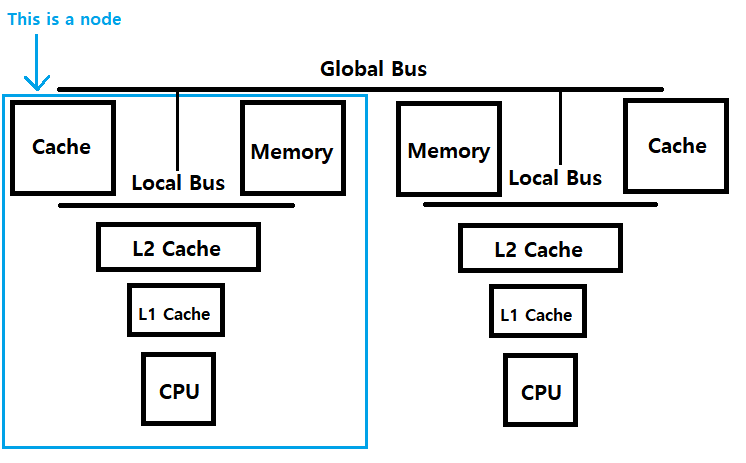

## Hierarchical Cache & Bus Architecture for Shared Memory Multiprocessors

This is summary of [Hierarchical Cache & Bus Architecture for Shared Memory Multiprocessors", Andrew W. Wilson Jr, 1987](https://dl.acm.org/doi/10.1145/30350.30378)  
This is just a summary; details are in the paper!

## What is the problem this paper solves?

  
In the Von Neumann architecture, memory becomes a bottleneck because memory is much slower than CPU. Even in modern computers, access latency of CPU registers is faster than its main memory (DRAM) 100 times. By introducing cache memory between CPU and main memory, the memory traffic can be reduced. But this papers says a single central cache controller is not enough; It proposes hierarchical architecture in cache and memory.  

Both hierarchical cache and bus architectures reduces much of global bus traffic, allowing the computer to have more than 128 processors.

## Hierarchical Cache Architecture

The simple way to reduce bus traffic is introducing hierarchical cache architecture. As lower level caches can be slower and cheaper, it does not increase price seriously but reduces bus traffic. But to see good performance gain lower level caches should be much larger than higher level cacaches.

p.s.  
note that in the paper, "higher level" caches are faster and more expensive, "lower level" caches are slower and cheaper.  

## Hierarchical Bus Architecture

Distributing memory and buses using hierarchical architecture greatly reduces traffic of global bus. as bus traffic is distributed to many local buses, this architecture is scalable with number of processors. Nowdays, this architecture is NUMA (Non-Uniform Memory Access) and broadly used in high performance computers.  

One consideration in this architecture is memory allocation policy. [This paper is nice introduction to NUMA](https://queue.acm.org/detail.cfm?id=2513149)

## Conclusion

- By introducing hierarchical cache architecture, its cache coherency algorithms can be used in multiple cluster architecture.
- In the simulation results, even in larger systems the multicache coherency algorithm's cost is quite small.
- Hierarchical cache reduces global bus traffic and decreases access latency.
- If cache miss and remote cluster (remote node) accesses are so high, it can be a problem in large systems.
